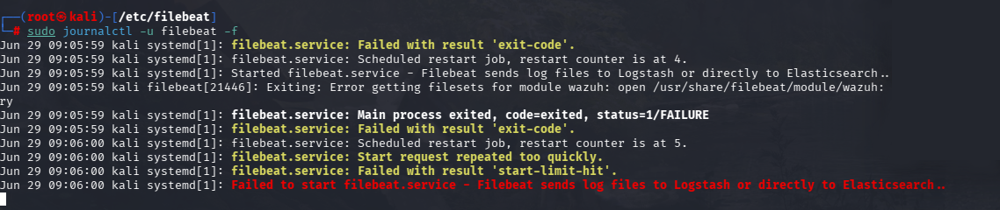
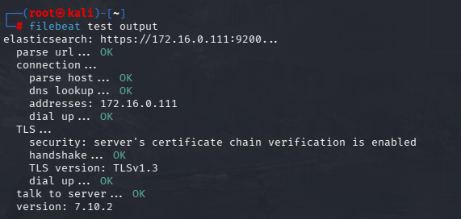

# Phase 4: Filebeat Integration

## Goal

Configure Filebeat as the log shipping component between the Wazuh Manager and the Wazuh Indexer.

## Why Filebeat Replaced Graylog

Graylog was originally tested as an additional log management layer, but it introduced version compatibility issues with Graylog 6.6, OpenSearch, and the Wazuh Indexer.

Filebeat was chosen instead because it is part of the standard Wazuh deployment flow and integrates more directly with the Wazuh Manager, Indexer, and Dashboard.

## Role in the Architecture

Filebeat forwards processed Wazuh alerts from the Wazuh Manager to the Wazuh Indexer, where they can be searched and visualized through the Wazuh Dashboard.

## Steps Completed

- Installed Filebeat
- Configured Filebeat to communicate with the Wazuh Indexer
- Deployed the Wazuh Filebeat module/template
- Configured certificates for secure communication
- Started and enabled the Filebeat service
- Verified that Filebeat was shipping alerts successfully

## Issues Faced

- Replaced Graylog due to compatibility issues
- Needed to confirm correct certificate paths
- Needed to verify Filebeat-to-Indexer connectivity
- Needed to confirm alerts were reaching the Wazuh Dashboard

## Issue with bootup due to `usr/share/filebeat/module/wazuh` not being found

Using `journalctl` and `tail` commands allowed for better and smoother workflow when it came to **trouble shooting**.



Configured a proper directory to `usr/share/filebeat/module/wazuh` and installed the needed configurations for Filbeat's use case, using `curl` 

```text
sudo curl -s https://packages.wazuh.com/4.x/filebeat/wazuh-filebeat-0.4.tar.gz | sudo tar -xvz -C /usr/share/filebeat/module
```

Adding in the module resolved the issue 

## Verification

Using the built in command tool `filebeat test output` rendered a proper status or health output, which green lit the tool **Filebeat** to be added into the entire **SOC Architecture**. 




