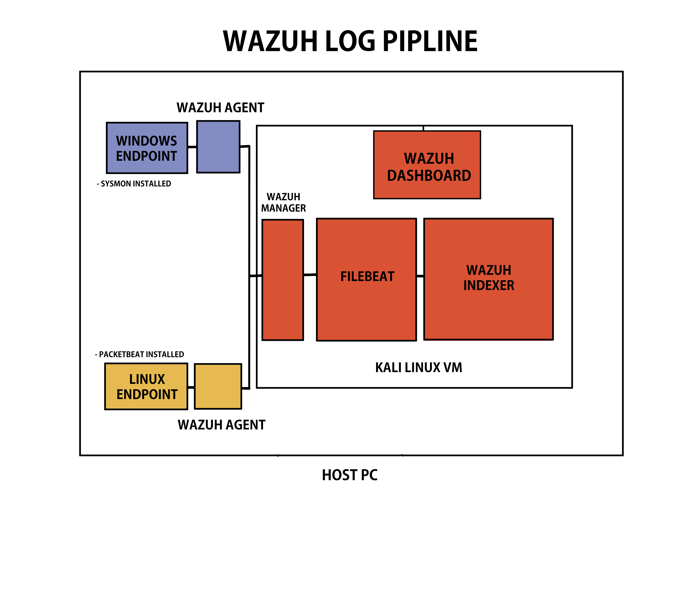

# Blue Team SOC Lab

This repository documents my ongoing SOC lab build, focused on blue team operations, log collection, detection, SIEM integration, SOAR automation, and alert/case management concepts.

## Environment
- Kali Linux VM
- Ubuntu VMs
- VirtualBox
- Local lab network
- Docker

## GOAL

Build and document a functional Blue Team SOC lab using Wazuh, log collection, detection workflows, SOAR automation, and eventually cloud-based security monitoring.

## Lab Phases

| Phase | Component | Status | Documentation |
|---|---|---|---|
| 1 | Wazuh Indexer | Completed | [View Docs](./Wazuh-Indexer/README.md) |
| 2 | Wazuh Dashboard | Completed | [View Docs](./Wazuh-Dashboard/README.md) |
| 3 | Wazuh Manager | Completed | [View Docs](./Wazuh-Manager/README.md) |
| 4 | Filebeat | Completed | [View Docs](./Filebeat/README.md) |
| 5 | Wazuh Agents | Completed | [View Docs](./Wazuh-Agents/README.md) |
| 6 | Docker | Completed | [View Docs](./Docker/README.md) |
| 7 | Shuffle SOAR | Completed | [View Docs](./Shuffle/README.md) |
| 8 | TheHive | Completed | [View Docs](./TheHive/README.md) |

## SOAR-Driven Alert Pipeline

```text
Linux Endpoint
   ↓
SSH failed login / brute-force activity
   ↓
Wazuh Agent
   ↓
Wazuh Manager
   ↓
custom-shuffle.py integration
   ↓
Shuffle Webhook
   ↓
TheHive Create Alert action
   ↓
TheHive OmarSOC Alerts Queue
```

## Archived-Experiments

| Component | Status | Documentation |
|---|---|---|
| Graylog | Compatibility Mismatch | [View Docs](./Archived-Experiments/Graylog/README.md) |

## Log Pipeline Architecture


