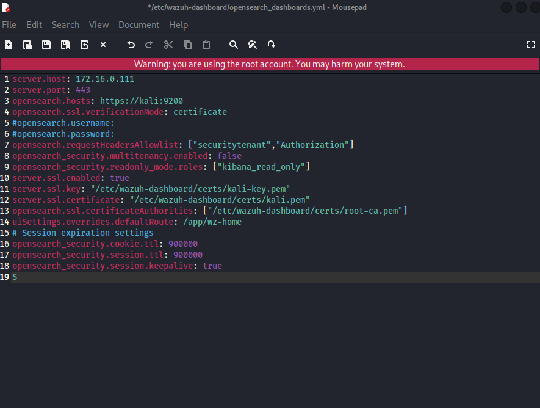
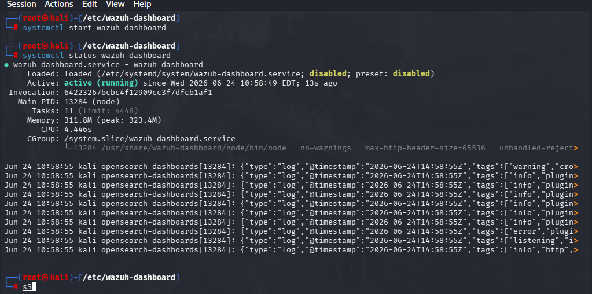
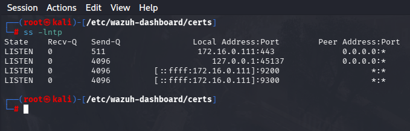
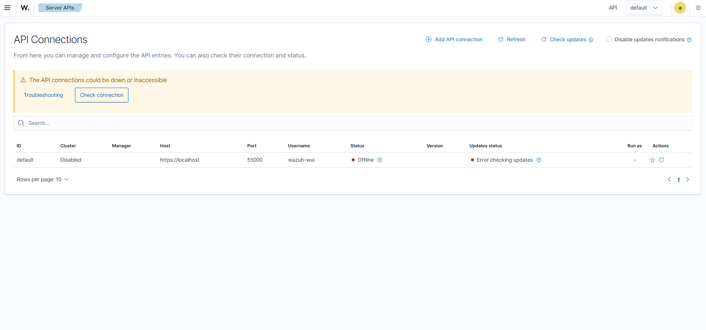

# Phase 2: Wazuh Dashboard Setup

## Goal
Set up the Wazuh Dashboard as the UI and Visual component of the SOC lab.

## Steps Completed
- Reused the previously configured Wazuh repository and GPG key
- - Installed Wazuh Dashboard using `apt install wazuh-dashboard`
- I extracted the Wazuh certificate files from the tar archive and placed them in the Wazuh Dashboard certificate directory, then configured opensearch_dashboards.yml to point to those certificate paths.
- Configured `opensearch-dashboards.yml`
- Set file permissions and ownership to Wazuh Dashboard
- Started the service
- Checked to make sure the ports and service was accessible `netstat -ltpdn` or `sudo ss -ltnp`

## Issues Faced
- No major issues; setup was straightforward compared to the Indexer phase.

## Verification
- Checked service status with `systemctl status wazuh-dashboard`
- Confirmed dashboard was live on local browser by going to `hostname/IP` then `port`

## What I Learned
- How Wazuh Dashboard fits into the SOC stack
- Why certificate permissions matter and how different Wazuh services reference their certificate paths

## Configuring Opensearch-dashboard.yml File

## Activating Wazuh Dashboard Service and Verifying Status `using systemctl`

## Checking Ports and Listening Services to verify Functionality `using netstat -ltpdn`

## Connecting to Wazuh Dashboard on Local Browser `hostname/ip:port`

