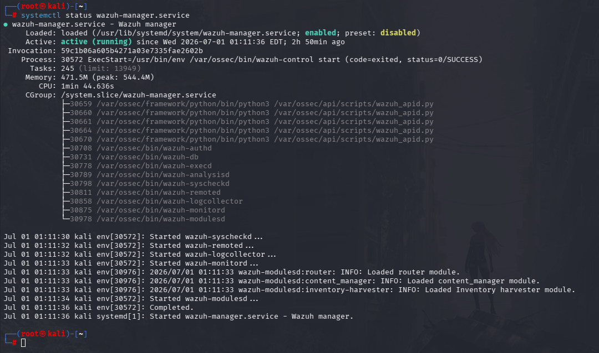
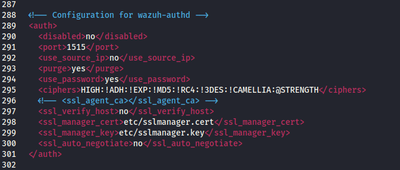
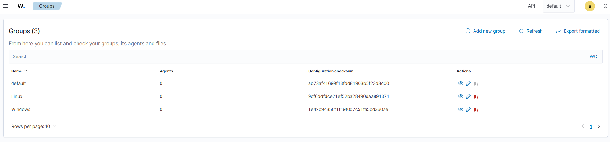

# Phase 3: Wazuh Manager Setup

## Goal

Set up the Wazuh Manager as the central security monitoring component of the SOC lab.

The Wazuh Manager is responsible for receiving, processing, and analyzing security events from Wazuh agents. It acts as the core detection engine in the Wazuh stack and works together with the Wazuh Indexer and Dashboard.

---

## Steps Completed

* Installed the Wazuh Manager package using `apt`
* Started the Wazuh Manager service
* Verified that the service was running successfully
* Confirmed that the Wazuh Manager was ready for agent connections
* * Added `Password` as a security measure when allowing agents to connect to the manager
* Initialized Groups within the Wazuh Dashboard for a better streamlined and organized input
```text
1. Linux
2. Windows
3. Default
```
* Configured the `XML file`'s for deloyed **Wazuh Agents**

---

## Installation

The Wazuh repository had already been added during the earlier Wazuh Indexer setup phase.

The Wazuh Manager was installed using:

```bash
sudo apt install wazuh-manager
```

After installation, the service was started using:

```bash
sudo systemctl start wazuh-manager
```

The service was also enabled to start automatically on boot:

```bash
sudo systemctl enable wazuh-manager
```

---

## Logs

Wazuh Manager logs can be checked using:

```bash
sudo tail -f /var/ossec/logs/ossec.log
```

This log file is useful for checking manager startup messages, agent connection activity, errors, and general Wazuh service behavior.

---

## Issues Faced

This setup phase was straightforward compared to the Wazuh Indexer and Graylog setup.

No major issues were encountered during the Wazuh Manager installation.

The main requirement was making sure that:

* The Wazuh repository was already configured
* The package installed correctly through `apt`
* The service started successfully through `systemctl`

---

## Fixes Applied

No major fixes were required.

The Wazuh Manager installed and started successfully after installation.

---

## Verification of Service

The Wazuh Manager service status was checked using:

```bash
sudo systemctl status wazuh-manager
```



The successful service status confirmed that the Wazuh Manager was running and ready to receive data from agents.

---

## Initiallizing Password for Security

When initiallizing agents, a `Password` was made in place and a requirement to be able to connect to the `Wazuh-Manager` 



Using a `.pass` to configure a password 

```text
echo "<MY PASSWORD>" /var/ossec/etc/authd.pss
```

And then transfering ownership to `root:wazuh` for proper permissions control

```text
chmod 640 /var/ossec/etc/authd.pass
chown root:wazuh /var/ossec/etc/authd.pass
```

---

## Adding Groups within Manager

Added distinct groups within the `Wazuh-Interface` to have a more organized and streamlined **Log Pipeline**.



As Organizing the Log pipline helps during log analysis. I added two distinct groups for this Lab, a `Windows` and `Linux` Group.

---

## Configuring Agent Configs XML/Rules

Using the Wazuh-Interface to configure `agent-configs`

## Linux Group :
```text

  <agent_config>
    <client_buffer>
      <!-- Agent buffer options -->
      <disabled>no</disabled>
      <queue_size>5000</queue_size>
      <events_per_second>500</events_per_second>
    </client_buffer>
    <!-- Policy monitoring -->
    <rootcheck>
      <disabled>no</disabled>
      <!-- Frequency that rootcheck is executed - every 12 hours -->
      <frequency>43200</frequency>
      <rootkit_files>/var/ossec/etc/shared/rootkit_files.txt</rootkit_files>
      <rootkit_trojans>/var/ossec/etc/shared/rootkit_trojans.txt</rootkit_trojans>
      <system_audit>/var/ossec/etc/shared/system_audit_rcl.txt</system_audit>
      <system_audit>/var/ossec/etc/shared/system_audit_ssh.txt</system_audit>
      <system_audit>/var/ossec/etc/shared/cis_debian_linux_rcl.txt</system_audit>
      <skip_nfs>yes</skip_nfs>
    </rootcheck>
    <wodle name="open-scap">
      <disabled>yes</disabled>
      <timeout>1800</timeout>
      <interval>1d</interval>
      <scan-on-start>yes</scan-on-start>
      <content type="xccdf" path="ssg-debian-8-ds.xml">
        <profile>xccdf_org.ssgproject.content_profile_common</profile>
      </content>
      <content type="oval" path="cve-debian-oval.xml"/>
    </wodle>
    <!-- File integrity monitoring -->
    <syscheck>
      <disabled>no</disabled>
      <!-- Frequency that syscheck is executed default every 12 hours -->
      <frequency>43200</frequency>
      <scan_on_start>yes</scan_on_start>
      <!-- Directories to check  (perform all possible verifications) -->
      <directories>/etc,/usr/bin,/usr/sbin</directories>
      <directories>/bin,/sbin,/boot</directories>
      <!-- Files/directories to ignore -->
      <ignore>/etc/mtab</ignore>
      <ignore>/etc/hosts.deny</ignore>
      <ignore>/etc/mail/statistics</ignore>
      <ignore>/etc/random-seed</ignore>
      <ignore>/etc/random.seed</ignore>
      <ignore>/etc/adjtime</ignore>
      <ignore>/etc/httpd/logs</ignore>
      <ignore>/etc/utmpx</ignore>
      <ignore>/etc/wtmpx</ignore>
      <ignore>/etc/cups/certs</ignore>
      <ignore>/etc/dumpdates</ignore>
      <ignore>/etc/svc/volatile</ignore>
      <ignore>/sys/kernel/security</ignore>
      <ignore>/sys/kernel/debug</ignore>
      <!-- File types to ignore -->
      <ignore type="sregex">.log$|.swp$</ignore>
      <!-- Check the file, but never compute the diff -->
      <nodiff>/etc/ssl/private.key</nodiff>
      <skip_nfs>yes</skip_nfs>
      <skip_dev>yes</skip_dev>
      <skip_proc>yes</skip_proc>
      <skip_sys>yes</skip_sys>
      <!-- Nice value for Syscheck process -->
      <process_priority>10</process_priority>
      <!-- Maximum output throughput -->
      <max_eps>100</max_eps>
      <!-- Database synchronization settings -->
      <synchronization>
        <enabled>yes</enabled>
        <interval>5m</interval>
        <response_timeout>30</response_timeout>
        <queue_size>16384</queue_size>
        <max_eps>10</max_eps>
      </synchronization>
    </syscheck>
    <!-- Log analysis -->
    <localfile>
      <log_format>syslog</log_format>
      <location>/var/ossec/logs/active-responses.log</location>
    </localfile>
    <localfile>
      <log_format>syslog</log_format>
      <location>/var/log/messages</location>
    </localfile>
    <localfile>
      <log_format>syslog</log_format>
      <location>/var/log/auth.log</location>
    </localfile>
    <localfile>
      <log_format>syslog</log_format>
      <location>/var/log/syslog</location>
    </localfile>
    <localfile>
      <log_format>command</log_format>
      <command>df -P</command>
      <frequency>360</frequency>
    </localfile>
    <localfile>
      <log_format>full_command</log_format>
      <command>netstat -tan |grep LISTEN |grep -v 127.0.0.1 | sort</command>
      <frequency>360</frequency>
    </localfile>
    <localfile>
      <log_format>full_command</log_format>
      <command>last -n 5</command>
      <frequency>360</frequency>
    </localfile>
    <wodle name="osquery">
      <disabled>yes</disabled>
      <run_daemon>yes</run_daemon>
      <log_path>/var/log/osquery/osqueryd.results.log</log_path>
      <config_path>/etc/osquery/osquery.conf</config_path>
      <add_labels>yes</add_labels>
    </wodle>
    <wodle name="syscollector">
      <disabled>no</disabled>
      <interval>24h</interval>
      <scan_on_start>yes</scan_on_start>
      <packages>yes</packages>
      <os>yes</os>
      <hotfixes>yes</hotfixes>
      <ports all="no">yes</ports>
      <processes>yes</processes>
    </wodle>
  </agent_config>


```

## Windows Group :

```text

  <agent_config>
    <client_buffer>
      <!-- Agent buffer options -->
      <disabled>no</disabled>
      <queue_size>5000</queue_size>
      <events_per_second>500</events_per_second>
    </client_buffer>
    <!-- Policy monitoring -->
    <rootcheck>
      <disabled>no</disabled>
      <windows_apps>./shared/win_applications_rcl.txt</windows_apps>
      <windows_malware>./shared/win_malware_rcl.txt</windows_malware>
    </rootcheck>
    <sca>
      <enabled>yes</enabled>
      <scan_on_start>yes</scan_on_start>
      <interval>12h</interval>
      <skip_nfs>yes</skip_nfs>
    </sca>
    <!-- File integrity monitoring -->
    <syscheck>
      <disabled>no</disabled>
      <!-- Frequency that syscheck is executed default every 12 hours -->
      <frequency>43200</frequency>
      <!-- Default files to be monitored. -->
      <directories recursion_level="0" restrict="regedit.exe$|system.ini$|win.ini$">%WINDIR%</directories>
      <directories recursion_level="0" restrict="at.exe$|attrib.exe$|cacls.exe$|cmd.exe$|eventcreate.exe$|ftp.exe$|lsass.exe$|net.exe$|net1.exe$|netsh.exe$|reg.exe$|regedt32.exe|regsvr32.exe|runas.exe|sc.exe|schtasks.exe|sethc.exe|subst.exe$">%WINDIR%\SysNative</directories>
      <directories recursion_level="0">%WINDIR%\SysNative\drivers\etc</directories>
      <directories recursion_level="0" restrict="WMIC.exe$">%WINDIR%\SysNative\wbem</directories>
      <directories recursion_level="0" restrict="powershell.exe$">%WINDIR%\SysNative\WindowsPowerShell\v1.0</directories>
      <directories recursion_level="0" restrict="winrm.vbs$">%WINDIR%\SysNative</directories>
      <!-- 32-bit programs. -->
      <directories recursion_level="0" restrict="at.exe$|attrib.exe$|cacls.exe$|cmd.exe$|eventcreate.exe$|ftp.exe$|lsass.exe$|net.exe$|net1.exe$|netsh.exe$|reg.exe$|regedit.exe$|regedt32.exe$|regsvr32.exe$|runas.exe$|sc.exe$|schtasks.exe$|sethc.exe$|subst.exe$">%WINDIR%\System32</directories>
      <directories recursion_level="0">%WINDIR%\System32\drivers\etc</directories>
      <directories recursion_level="0" restrict="WMIC.exe$">%WINDIR%\System32\wbem</directories>
      <directories recursion_level="0" restrict="powershell.exe$">%WINDIR%\System32\WindowsPowerShell\v1.0</directories>
      <directories recursion_level="0" restrict="winrm.vbs$">%WINDIR%\System32</directories>
      <directories realtime="yes">%PROGRAMDATA%\Microsoft\Windows\Start Menu\Programs\Startup</directories>
      <ignore>%PROGRAMDATA%\Microsoft\Windows\Start Menu\Programs\Startup\desktop.ini</ignore>
      <ignore type="sregex">.log$|.htm$|.jpg$|.png$|.chm$|.pnf$|.evtx$</ignore>
      <!-- Windows registry entries to monitor. -->
      <windows_registry>HKEY_LOCAL_MACHINE\Software\Classes\batfile</windows_registry>
      <windows_registry>HKEY_LOCAL_MACHINE\Software\Classes\cmdfile</windows_registry>
      <windows_registry>HKEY_LOCAL_MACHINE\Software\Classes\comfile</windows_registry>
      <windows_registry>HKEY_LOCAL_MACHINE\Software\Classes\exefile</windows_registry>
      <windows_registry>HKEY_LOCAL_MACHINE\Software\Classes\piffile</windows_registry>
      <windows_registry>HKEY_LOCAL_MACHINE\Software\Classes\AllFilesystemObjects</windows_registry>
      <windows_registry>HKEY_LOCAL_MACHINE\Software\Classes\Directory</windows_registry>
      <windows_registry>HKEY_LOCAL_MACHINE\Software\Classes\Folder</windows_registry>
      <windows_registry arch="both">HKEY_LOCAL_MACHINE\Software\Classes\Protocols</windows_registry>
      <windows_registry arch="both">HKEY_LOCAL_MACHINE\Software\Policies</windows_registry>
      <windows_registry>HKEY_LOCAL_MACHINE\Security</windows_registry>
      <windows_registry arch="both">HKEY_LOCAL_MACHINE\Software\Microsoft\Internet Explorer</windows_registry>
      <windows_registry>HKEY_LOCAL_MACHINE\System\CurrentControlSet\Services</windows_registry>
      <windows_registry>HKEY_LOCAL_MACHINE\System\CurrentControlSet\Control\Session Manager\KnownDLLs</windows_registry>
      <windows_registry>HKEY_LOCAL_MACHINE\System\CurrentControlSet\Control\SecurePipeServers\winreg</windows_registry>
      <windows_registry arch="both">HKEY_LOCAL_MACHINE\Software\Microsoft\Windows\CurrentVersion\Run</windows_registry>
      <windows_registry arch="both">HKEY_LOCAL_MACHINE\Software\Microsoft\Windows\CurrentVersion\RunOnce</windows_registry>
      <windows_registry>HKEY_LOCAL_MACHINE\Software\Microsoft\Windows\CurrentVersion\RunOnceEx</windows_registry>
      <windows_registry arch="both">HKEY_LOCAL_MACHINE\Software\Microsoft\Windows\CurrentVersion\URL</windows_registry>
      <windows_registry arch="both">HKEY_LOCAL_MACHINE\Software\Microsoft\Windows\CurrentVersion\Policies</windows_registry>
      <windows_registry arch="both">HKEY_LOCAL_MACHINE\Software\Microsoft\Windows NT\CurrentVersion\Windows</windows_registry>
      <windows_registry arch="both">HKEY_LOCAL_MACHINE\Software\Microsoft\Windows NT\CurrentVersion\Winlogon</windows_registry>
      <windows_registry arch="both">HKEY_LOCAL_MACHINE\Software\Microsoft\Active Setup\Installed Components</windows_registry>
      <!-- Windows registry entries to ignore. -->
      <registry_ignore>HKEY_LOCAL_MACHINE\Security\Policy\Secrets</registry_ignore>
      <registry_ignore>HKEY_LOCAL_MACHINE\Security\SAM\Domains\Account\Users</registry_ignore>
      <registry_ignore type="sregex">\Enum$</registry_ignore>
      <registry_ignore>HKEY_LOCAL_MACHINE\System\CurrentControlSet\Services\MpsSvc\Parameters\AppCs</registry_ignore>
      <registry_ignore>HKEY_LOCAL_MACHINE\System\CurrentControlSet\Services\MpsSvc\Parameters\PortKeywords\DHCP</registry_ignore>
      <registry_ignore>HKEY_LOCAL_MACHINE\System\CurrentControlSet\Services\MpsSvc\Parameters\PortKeywords\IPTLSIn</registry_ignore>
      <registry_ignore>HKEY_LOCAL_MACHINE\System\CurrentControlSet\Services\MpsSvc\Parameters\PortKeywords\IPTLSOut</registry_ignore>
      <registry_ignore>HKEY_LOCAL_MACHINE\System\CurrentControlSet\Services\MpsSvc\Parameters\PortKeywords\RPC-EPMap</registry_ignore>
      <registry_ignore>HKEY_LOCAL_MACHINE\System\CurrentControlSet\Services\MpsSvc\Parameters\PortKeywords\Teredo</registry_ignore>
      <registry_ignore>HKEY_LOCAL_MACHINE\System\CurrentControlSet\Services\PolicyAgent\Parameters\Cache</registry_ignore>
      <registry_ignore>HKEY_LOCAL_MACHINE\Software\Microsoft\Windows\CurrentVersion\RunOnceEx</registry_ignore>
      <registry_ignore>HKEY_LOCAL_MACHINE\System\CurrentControlSet\Services\ADOVMPPackage\Final</registry_ignore>
      <!-- Frequency for ACL checking (seconds) -->
      <windows_audit_interval>60</windows_audit_interval>
      <!-- Nice value for Syscheck module -->
      <process_priority>10</process_priority>
      <!-- Maximum output throughput -->
      <max_eps>100</max_eps>
      <!-- Database synchronization settings -->
      <synchronization>
        <enabled>yes</enabled>
        <interval>5m</interval>
        <max_interval>1h</max_interval>
        <max_eps>10</max_eps>
      </synchronization>
    </syscheck>
    <!-- System inventory -->
    <wodle name="syscollector">
      <disabled>no</disabled>
      <interval>1h</interval>
      <scan_on_start>yes</scan_on_start>
      <hardware>yes</hardware>
      <os>yes</os>
      <network>yes</network>
      <packages>yes</packages>
      <ports all="no">yes</ports>
      <processes>yes</processes>
      <!-- Database synchronization settings -->
      <synchronization>
        <max_eps>10</max_eps>
      </synchronization>
    </wodle>
    <!-- CIS policies evaluation -->
    <wodle name="cis-cat">
      <disabled>yes</disabled>
      <timeout>1800</timeout>
      <interval>1d</interval>
      <scan-on-start>yes</scan-on-start>
      <java_path>\\server\jre\bin\java.exe</java_path>
      <ciscat_path>C:\cis-cat</ciscat_path>
    </wodle>
    <!-- Osquery integration -->
    <wodle name="osquery">
      <disabled>yes</disabled>
      <run_daemon>yes</run_daemon>
      <bin_path>C:\Program Files\osquery\osqueryd</bin_path>
      <log_path>C:\Program Files\osquery\log\osqueryd.results.log</log_path>
      <config_path>C:\Program Files\osquery\osquery.conf</config_path>
      <add_labels>yes</add_labels>
    </wodle>
    <!-- Active response -->
    <active-response>
      <disabled>no</disabled>
      <ca_store>wpk_root.pem</ca_store>
      <ca_verification>yes</ca_verification>
    </active-response>
    <!-- Log analysis -->
    <localfile>
      <location>Microsoft-Windows-Sysmon/Operational</location>
      <log_format>eventchannel</log_format>
    </localfile>
    <localfile>
      <location>Windows PowerShell</location>
      <log_format>eventchannel</log_format>
    </localfile>
    <localfile>
      <location>Microsoft-Windows-CodeIntegrity/Operational</location>
      <log_format>eventchannel</log_format>
    </localfile>
    <localfile>
      <location>Microsoft-Windows-TaskScheduler/Operational</location>
      <log_format>eventchannel</log_format>
    </localfile>
    <localfile>
      <location>Microsoft-Windows-PowerShell/Operational</location>
      <log_format>eventchannel</log_format>
    </localfile>
    <localfile>
      <location>Microsoft-Windows-Windows Firewall With Advanced Security/Firewall</location>
      <log_format>eventchannel</log_format>
    </localfile>
    <localfile>
      <location>Microsoft-Windows-Windows Defender/Operational</location>
      <log_format>eventchannel</log_format>
    </localfile>
  </agent_config>


```

The configurations for both group are stored in 

```text

/var/ossec/etc/shared/<GROUP_NAME>/agent.conf

```


This is configuration green lights Wazuh Agents for Deployment


## What I Learned

* The Wazuh Manager acts as the central analysis and detection component of the Wazuh stack
* The manager receives events from Wazuh agents
* The manager processes security events before they are indexed and displayed
* `systemctl` is used to start, stop, enable, and verify Wazuh services
* Wazuh Manager logs are stored under `/var/ossec/logs/`
* Not every setup phase requires heavy troubleshooting; some components can be deployed cleanly when dependencies and repositories are already configured

---

## Final Status

The Wazuh Manager was successfully installed and started.

```text
Wazuh Manager: running
Service startup: enabled
Manager logs: accessible
Ready for agent connections
```


